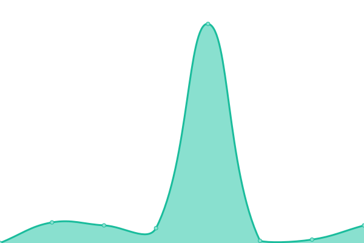

# [📈 Live Status](https://Arch-Network.github.io/upptime): <!--live status--> **🟧 Partial outage**

This repository contains the open-source uptime monitor and status page for [Arch Network](https://arch.network), powered by [Upptime](https://github.com/upptime/upptime).

With [Upptime](https://upptime.js.org), you can get your own unlimited and free uptime monitor and status page, powered entirely by a GitHub repository. We use [Issues](https://github.com/Arch-Network/upptime/issues) as incident reports, [Actions](https://github.com/Arch-Network/upptime/actions) as uptime monitors, and [Pages](https://Arch-Network.github.io/upptime) for the status page.

<!--start: status pages-->
<!-- This summary is generated by Upptime (https://github.com/upptime/upptime) -->
<!-- Do not edit this manually, your changes will be overwritten -->
<!-- prettier-ignore -->
| URL | Status | History | Response Time | Uptime |
| --- | ------ | ------- | ------------- | ------ |
|  [Arch Network Official Web Site](https://arch.network) | 🟩 Up | [arch-network-official-web-site.yml](https://github.com/Arch-Network/upptime/commits/HEAD/history/arch-network-official-web-site.yml) | 

 300ms
     
 | 

<a href="https://Arch-Network.github.io/upptime/history/arch-network-official-web-site">99.76%</a>
    

|  [Arch RPC Beta (https://rpc-beta.test.arch.network)](https://rpc-beta.test.arch.network) | 🟩 Up | [arch-rpc-beta-https-rpc-beta-test-arch-network.yml](https://github.com/Arch-Network/upptime/commits/HEAD/history/arch-rpc-beta-https-rpc-beta-test-arch-network.yml) | 

 290ms
     
 | 

<a href="https://Arch-Network.github.io/upptime/history/arch-rpc-beta-https-rpc-beta-test-arch-network">79.43%</a>
    

|  [Arch RPC Gamma (https://rpc-gamma.test.arch.network) Version: 0.4.0](https://rpc-gamma.test.arch.network) | 🟩 Up | [arch-rpc-gamma-https-rpc-gamma-test-arch-network-version-0-4-0.yml](https://github.com/Arch-Network/upptime/commits/HEAD/history/arch-rpc-gamma-https-rpc-gamma-test-arch-network-version-0-4-0.yml) | 

 283ms
     
 | 

<a href="https://Arch-Network.github.io/upptime/history/arch-rpc-gamma-https-rpc-gamma-test-arch-network-version-0-4-0">100.00%</a>
    

|  [Titan Public HTTP [Testnet] Status (https://titan-public-http.test.arch.network/status)](https://titan-public-http.test.arch.network/status) | 🟩 Up | [titan-public-http-testnet-status-https-titan-public-http-test-arch-network-status.yml](https://github.com/Arch-Network/upptime/commits/HEAD/history/titan-public-http-testnet-status-https-titan-public-http-test-arch-network-status.yml) | 

 269ms
     
 | 

<a href="https://Arch-Network.github.io/upptime/history/titan-public-http-testnet-status-https-titan-public-http-test-arch-network-status">100.00%</a>
    

|  [Titan Public TCP [Testnet] Status (titan-public-tcp.test.arch.network:8080)](titan-public-tcp.test.arch.network) | 🟩 Up | [titan-public-tcp-testnet-status-titan-public-tcp-test-arch-network-8080.yml](https://github.com/Arch-Network/upptime/commits/HEAD/history/titan-public-tcp-testnet-status-titan-public-tcp-test-arch-network-8080.yml) | 

 38ms
     
 | 

<a href="https://Arch-Network.github.io/upptime/history/titan-public-tcp-testnet-status-titan-public-tcp-test-arch-network-8080">100.00%</a>
    

|  [Arch Bitcoin Node [regtest] (bitcoin-node.dev.aws.archnetwork.xyz:18443 u:bitcoin p:428bae8f3c94f8c39c50757fc89c39bc7e6ebc70ebf8f618)](bitcoin-node.dev.aws.archnetwork.xyz) | 🟩 Up | [arch-bitcoin-node-regtest-bitcoin-node-dev-aws-archnetwork-xyz-18443-u-bitcoin-p-428bae8f3c94f8c39c50757fc89c39bc7e6ebc70ebf8f618.yml](https://github.com/Arch-Network/upptime/commits/HEAD/history/arch-bitcoin-node-regtest-bitcoin-node-dev-aws-archnetwork-xyz-18443-u-bitcoin-p-428bae8f3c94f8c39c50757fc89c39bc7e6ebc70ebf8f618.yml) | 

 37ms
     
 | 

<a href="https://Arch-Network.github.io/upptime/history/arch-bitcoin-node-regtest-bitcoin-node-dev-aws-archnetwork-xyz-18443-u-bitcoin-p-428bae8f3c94f8c39c50757fc89c39bc7e6ebc70ebf8f618">100.00%</a>
    

|  [Arch Bitcoin Node [testnet4] (bitcoin-node.test.aws.archnetwork.xyz:49332 u:bitcoin p:uU1taFBTUvae96UCtA8YxAepYTFszYvYVSXK8xgzBs0)](bitcoin-node.test.aws.archnetwork.xyz) | 🟥 Down | [arch-bitcoin-node-testnet4-bitcoin-node-test-aws-archnetwork-xyz-49332-u-bitcoin-p-u-u1ta-fbt-uvae96-u-ct-a8-yx-aep-yt-fsz-yv-yvsxk-8xgz-bs0.yml](https://github.com/Arch-Network/upptime/commits/HEAD/history/arch-bitcoin-node-testnet4-bitcoin-node-test-aws-archnetwork-xyz-49332-u-bitcoin-p-u-u1ta-fbt-uvae96-u-ct-a8-yx-aep-yt-fsz-yv-yvsxk-8xgz-bs0.yml) | 

 0ms
     
 | 

<a href="https://Arch-Network.github.io/upptime/history/arch-bitcoin-node-testnet4-bitcoin-node-test-aws-archnetwork-xyz-49332-u-bitcoin-p-u-u1ta-fbt-uvae96-u-ct-a8-yx-aep-yt-fsz-yv-yvsxk-8xgz-bs0">100.00%</a>
    

<!--end: status pages-->

[**Visit our status website →**](https://Arch-Network.github.io/upptime)

## 📄 License

- Powered by: [Upptime](https://github.com/upptime/upptime)
- Code: [MIT](./LICENSE) © [Anand Chowdhary](https://anandchowdhary.com), supported by [Pabio](https://pabio.com)
- Data in the `./history` directory: [Open Database License](https://opendatacommons.org/licenses/odbl/1-0/)
